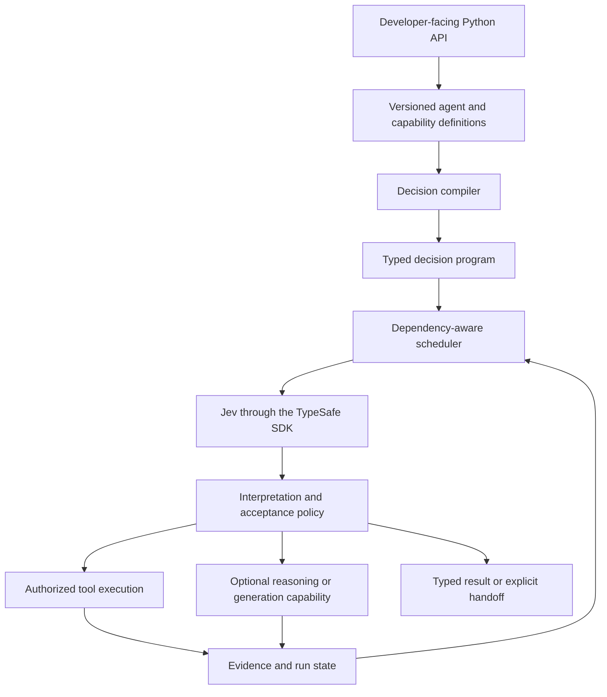

# Jev-Frame

A proposed Python framework for building agents powered by Jev, TypeSafe's structured decision model.

**Status: design and repository initialization only.**
There is no installable framework, implementation, executable example, or published package yet.
This is an independent project, not an official TypeSafe product.

## Purpose

Let developers create specialized agents through a public programming interface instead of constructing model requests and implementing orchestration themselves.
An agent author supplies an objective, typed tools, meaningful decisions, an output contract, and operating limits.
The framework manages evidence, compiles Jev questions, schedules evaluations and tools, and returns supported results or explicit unresolved outcomes.

The intended product is one framework with a reusable runtime underneath its developer-facing API.
Application-specific integrations belong in separate capability packages, not in the core.

## Why design around Jev

Jev evaluates supplied state and returns typed decisions rather than arbitrary generated text.
Its primitives are Choice, Noul, and Score, with probabilities and, where applicable, confidence.
Questions within one request are evaluated independently.
These properties suggest a framework built around decision dependencies and evidence rather than a conversational transcript.

The framework should exploit those properties through candidate binding, parallel independent judgments, explicit state, and selective recomputation.
It must not assume that a constrained output is correct, that confidence grants permission, or that a model can select a candidate it never received.

Official references: [System One](https://docs.typesafe.ai/concepts/system-one.md), [primitives](https://docs.typesafe.ai/primitives.md), and [state](https://docs.typesafe.ai/concepts/state.md).

## Framework, agents, and runs

| Concept | Meaning |
|---|---|
| Framework | Public API, decision compiler, evidence state, scheduler, execution policy, and evaluation support |
| Agent definition | A versioned objective family, tool set, judgment vocabulary, result contract, and policy |
| Agent run | One scoped task with its own inputs, state, budget, and result |
| Capability package | Reusable tools and semantic contracts for a domain or application |

Many definitions and concurrent runs can share the same runtime.
Creating an agent definition does not require creating a resident model or copying an event loop.
Execution remains bounded by provider capacity, tool limits, budgets, and permissions.

## Intended developer experience

Python is the proposed first language.
Public names and signatures are not finalized, and this README does not present fictional installation or usage commands.

A developer should be able to:

1. Register ordinary typed functions as tools, including their purpose and argument sources.
2. Define reusable semantic judgments with explicit subjects and possible outcomes.
3. Define an agent's objective, available capabilities, result shape, and completion conditions.
4. Run a task with application-supplied scope and operating limits.
5. Inspect its result, supporting evidence, unresolved questions, trace, and usage.
6. Evaluate behavior on held-out examples before enabling consequential actions.

Simple agents should require little configuration.
Advanced applications should be able to control candidate providers, decision dependencies, persistence, and acceptance policy through the same runtime.

## Proposed public concepts

These concepts describe the intended API; they are not implemented classes.

| Concept | Developer responsibility | Framework responsibility |
|---|---|---|
| Agent | Objective, tools, result, and operating policy | Compile and run the task |
| Tool | Typed operation, semantic purpose, argument sources, and side effects | Bind valid arguments, execute, and record outcomes |
| Judgment | Question meaning, subjects, alternatives or rubric | Construct Jev evaluations and retain distributions |
| Evidence | Values with source, scope, and freshness metadata | Track dependencies and build decision-specific views |
| Run result | Define what completion means | Return outcome, evidence, unresolved items, and usage |

Type hints alone are insufficient to create a reliable agent.
A string may represent a record ID, a verbatim source value, or newly generated prose, and each needs a different binding strategy.
Semantic contracts must describe where values come from and what the decision establishes.

## Architecture

These are logical boundaries, not a requirement for separate services.
Prefer an embeddable library and existing application infrastructure over a new platform.
The official [Python SDK](https://docs.typesafe.ai/sdk/python.md) should supply provider transport where suitable.

### Decision compiler

Compile task subjects, tool contracts, live candidates, and decision definitions into typed evaluation nodes with explicit dependencies.
Each generated question must identify its subjects and meaning without relying on its question ID.
Keep correlated arguments together: independently valid fields can still form an invalid combination.
Use valid tuples or sequential binding when one argument determines another's candidates.

Compiler checks can validate structure and references.
They cannot prove that a natural-language policy is correct or unambiguous.

### Candidate providers

Retrieve possible records, source values, capabilities, or approved plan templates before asking Jev to select among them.
Preserve retrieval scope, truncation, source version, and a way to expand the search.
Offer an explicit outcome when no candidate fits.
Do not hide the expected decision inside candidate metadata.

### Evidence state

Retain source observations, exact derived values, model judgments, and approved decisions as distinct records.
Build compact views for each decision while preserving relevant contradictions and links to originals.
Invalidate dependent judgments when their evidence, policy, model, or candidate set changes.
Reuse data only within compatible scope and authorization boundaries.

### Scheduler

Batch independent judgments when their inputs are ready.
Use explicit speculative premises for branch-specific questions, then consume only the applicable answers.
Create another evaluation boundary when a question genuinely depends on an earlier answer.
Execute independent reads concurrently when scope and consistency permit; never speculate on external mutations.

### Adaptive investigation

Represent unresolved questions explicitly and expose tools that can address them.
Distinguish missing evidence, source conflicts, insufficient candidate coverage, refuted claims, and semantic ambiguity.
Permit bounded retries, alternative sources, and expanded retrieval.
Continue while an action can make useful progress, rather than repeating requests until confidence rises.

### Acceptance and execution

Keep semantic confidence, evidence sufficiency, action selection, and execution authority separate.
Calibrate acceptance behavior on validation data and freeze it for held-out testing.
Apply permissions, schema checks, source-version checks, and transaction controls independently of model output.
Reconcile ambiguous write outcomes before retrying; do not promise exactly-once effects without downstream support.

### Agent composition

Expose an agent as a typed capability when another agent needs its specialization.
Exchange results and evidence references rather than free-form conversations by default.
Child runs inherit narrower-or-equal authority and a shared overall budget.
Bound concurrency, propagate cancellation, detect cycles, and preserve conflicting results.

### Optional LLM capabilities

Use explicit reasoning or generation capabilities for unfamiliar plans, unrestricted text, code, or interpretations outside the available decision vocabulary.
Their returned plans and results require structural and evidence checks.
A reusable harness does not imply that Jev alone can solve arbitrary tasks.
Do not automatically promote a generated plan into permanent policy.

## Scope boundaries

The core should contain reusable agent machinery, not application-specific business rules, customer data, credentials, or private benchmark history.
Domain packages should supply their own tools, vocabularies, policies, and completion contracts.
The host application should supply authorization, tenant scope, storage, and permission for side effects.

The initial design does not require a new database, distributed queue, model gateway, multi-language runtime, visual builder, or hosted service.
Add such components only when concrete use cases justify them.

## Evaluation principles

Measure supported independent completion separately from correct escalation.
Record harmful automatic errors, unnecessary handoffs, retrieval failures, service failures, latency, and verified cost per correct completion.
Keep expected answers and evaluator-only metadata outside model inputs.
Evaluate acceptable evidence paths rather than enforcing a predetermined tool sequence.

Compare sufficient-evidence Jev, agentic retrieval, and relevant existing alternatives under matched conditions.
Test unfamiliar combinations of registered tools without changing the core controller for each example.
Report the amount of new semantic configuration each domain requires.
Do not treat repeated cases as independent samples or claim that small error-free tests establish full reliability.

## Current repository contents

| Path | Purpose |
|---|---|
| `README.md` | Project intent, proposed architecture, and scope |
| `AGENTS.md` | Project instructions for coding agents |
| `.codex/config.toml` | Project-local Codex model defaults |
| `.codex/README.md` | Codex usage and continuation context |
| `.gitignore` | Keep credentials and generated local files out of Git |

The next design deliverable, when requested, is a public API specification with representative usage examples.
Implementation has not started.
Package naming, licensing, final API signatures, persistence details, and acceptance thresholds remain open decisions.

## Further reading

- [TypeSafe documentation index](https://docs.typesafe.ai/llms.txt)
- [HTTP API](https://docs.typesafe.ai/api.md)
- [Structured questions](https://docs.typesafe.ai/primitives/advanced.md)
- [Function calling](https://docs.typesafe.ai/cookbooks/function_calling.md)
- [Speculative fan-out](https://docs.typesafe.ai/patterns/fan-out.md)
- [Confidence](https://docs.typesafe.ai/confidence.md)
- [Source-value selection](https://docs.typesafe.ai/cookbooks/pre_parsed_value_extraction_cookbook.md)

No license has been selected yet.
Do not assume redistribution rights or publish a package until licensing is decided.
