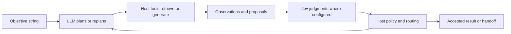
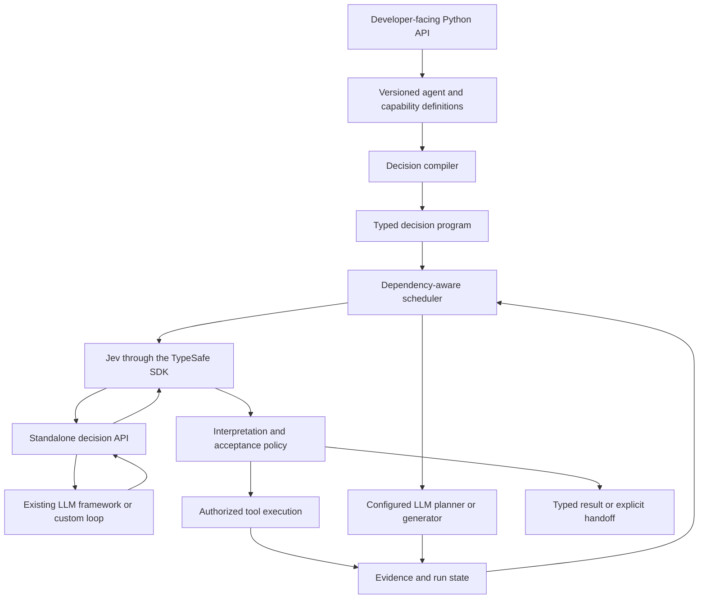

# Jev-Frame

A proposed Python framework for building Jev agents and integrating Jev decisions into existing LLM agents.

**Status: JF-18 bounded document-collection evidence is implemented locally; JF-19 sanitized capture and replay is the next backlog issue.**
The local package exposes strict definitions, run-local state, deterministic compilation and preview, the asynchronous official SDK adapter, direct decisions, default-safe inspection, explicitly bound capability packages, and one shared runtime.
Live provider compatibility remains unverified, and no real consequential write has been authorized or exercised.
This is an independent project, not an official TypeSafe product.

## Local development

Use the checked lockfile to create the project environment and run the current behavioral checks:

```sh
uv sync
uv run python -m unittest discover -s tests -v
```

Build local artifacts with `uv build`.
The core import performs no network request, credential lookup, or optional-framework import.
No package has been published.

## Purpose

Let developers create specialized agents through a public programming interface instead of constructing model requests and implementing orchestration themselves.
An agent author supplies an objective, typed tools, meaningful decisions, an output contract, and operating limits.
The framework manages evidence, compiles Jev questions, schedules evaluations and tools, and returns supported results or explicit unresolved outcomes.

The intended product is one framework with a reusable runtime underneath its developer-facing API.
Developers can also use its decision API directly inside another framework without adopting the Jev-Frame scheduler or defining a complete Jev agent.
An LLM can own planning, generation, and replanning while Jev supplies structured judgments at developer-selected points in the loop.
Application-specific integrations belong in separate capability packages, not in the core.

## Why design around Jev

Jev evaluates supplied state and returns typed decisions rather than arbitrary generated text.
Its primitives are Choice, Noul, and Score, with probabilities and, where applicable, confidence.
Questions within one request are evaluated independently.
These properties suggest a framework built around decision dependencies and evidence rather than a conversational transcript.

The framework should exploit those properties through candidate binding, parallel independent judgments, explicit state, and selective recomputation.
It must not assume that a constrained output is correct, that confidence grants permission, or that a model can select a candidate it never received.

Official references: [System One](https://docs.typesafe.ai/concepts/system-one.md), [primitives](https://docs.typesafe.ai/primitives.md), and [state](https://docs.typesafe.ai/concepts/state.md).

## Framework, agents, and runs

| Concept | Meaning |
|---|---|
| Framework | Public API, decision compiler, evidence state, scheduler, execution policy, and evaluation support |
| Agent definition | A versioned objective family, tool set, judgment vocabulary, result contract, and policy |
| Agent run | One scoped task with its own inputs, state, budget, and result |
| Capability package | Reusable tools and semantic contracts for a domain or application |

Many definitions and concurrent runs can share the same runtime.
Creating an agent definition does not require creating a resident model or copying an event loop.
Execution remains bounded by provider capacity, tool limits, budgets, and permissions.

## Intended developer experience

Python is the first implementation language.
The initial public names and behavioral contracts below are frozen for local implementation.
They may change only through a documented contract revision that updates affected tests and compatibility notes.

A developer should be able to:

1. Register ordinary typed functions as tools, including their purpose and argument sources.
2. Define reusable semantic judgments with explicit subjects and possible outcomes.
3. Define an agent's objective, available capabilities, result shape, and completion conditions.
4. Run a task with application-supplied scope and operating limits.
5. Inspect its result, supporting evidence, unresolved questions, trace, and usage.
6. Evaluate behavior on held-out examples before enabling consequential actions.
7. Call a standalone Jev judgment from an existing LLM tool, graph node, evaluator, or execution hook.
8. Start with an objective string and let a configured LLM agent plan and replan using the application's tools and Jev decisions.

Simple agents should require little configuration.
Advanced applications should be able to control candidate providers, decision dependencies, persistence, and acceptance policy through the same runtime.

## Frozen initial contract

This section fixes the JF-01 contract surface.
JF-02 implements its definition, binding, context, usage, and result types, JF-03 implements shared state, JF-04 implements compilation and preview, JF-05 implements the official SDK adapter, JF-06 implements direct decisions and shared admission, and JF-09 implements the read-only runtime.
Later issues implement guarded execution and the extended entry points shown below.

### Compatibility baseline

| Component | Initial contract | Read-only verification on 2026-09-19 |
|---|---|---|
| Python | Support Python 3.11 and newer; the delivery issue records the exact tested matrix. | `typesafe-sdk==0.7.0` imported and its question models instantiated on CPython 3.11.15 and 3.14.6. |
| TypeSafe SDK | Use the official `typesafe-sdk==0.7.0` transport and response models. | PyPI metadata declares Python 3.10 or newer; local isolated resolution used Pydantic 2.13.5. |
| Boundary validation | Declare Pydantic directly as `pydantic>=2.12,<3` and use strict `TypeAdapter` validation. | SDK 0.7.0 itself requires Pydantic 2.12 or newer after replacing `msgspec`. |
| LangChain and LangGraph | Optional extra `jev-frame[langchain]`; target the public tool, `ToolRuntime`, node, and agent interfaces in LangChain 1.4.2 and LangGraph 1.2.11. | Offline conformance invokes a real `ToolNode` and `StateGraph`, keeps host context out of the model-visible schema, preserves the full result artifact, and leaves execution ownership with the host. |
| Pydantic AI | Optional extra `jev-frame[pydantic-ai]`; target Pydantic AI Slim 2.46.0 with its TypeSafe extra and reuse `TypeSafeModel` where its translated metadata is sufficient. | Offline conformance exercises `FunctionModel`, `Tool`, `ToolReturn`, `ToolOutput`, and a scripted native `TypeSafeModel` without credentials. |

The core records the requested and returned TypeSafe model names separately.
Moving aliases such as `jev-latest` are allowed for experiments but are not reusable evidence across provider calls unless the returned version is pinned and recorded.
The deterministic suite never needs credentials or a live provider call.

Pydantic AI native Jev integration is a host adapter rather than Jev-Frame's canonical provider record.
It rounds Noul values when mapped to `bool`, rounds Score values when mapped to an integer rubric, and keeps fuller values in provider details only where the native mapping exposes them.
Its fallback response can omit usage for an earlier Jev attempt, `RequestUsage.requests` does not carry Jev's actual multi-request count, and output functions bypass function-tool execution hooks.
Jev-Frame therefore uses the official SDK adapter for canonical `ChoiceAnswer`, `NoulAnswer`, and `ScoreAnswer` evidence, while a Pydantic AI adapter reports observable native metadata and marks missing attempt usage explicitly unknown.

### Supported values and strict validation

The initial supported application type subset is `str`, `int`, `float`, `bool`, `None`, string-valued `Enum`, `Literal`, `list[T]`, `dict[str, T]`, `T | None`, dataclasses, and Pydantic `BaseModel` records composed from the same subset.
Integers and booleans remain distinct, mapping keys must be strings, arbitrary objects are rejected, and only `T | None` is accepted as a general union.
`Literal` members use their exact scalar types, so `True` cannot satisfy `Literal[1]` and `1` cannot satisfy `Literal[True]`.
Unresolved annotations, variadic parameters, positional-only parameters, unsupported generics, and callable return annotations outside this subset are definition errors.
Strict validation does not coerce strings to numbers, booleans to identifiers, or arbitrary mappings to application objects silently.

An omitted argument is represented internally by a dedicated missing sentinel and is different from an explicit `None`.
Function defaults are used only through `DefaultBinding`, and the recorded binding explains why the default was selected.
All definitions are immutable after validation and use an explicit semantic version string plus a separately computed compiled digest.

Every tool parameter has exactly one of these public binding definitions:

| Binding | Source and rule |
|---|---|
| `TaskInputBinding(path)` | Copy a strict value from the validated run input at an explicit path. |
| `HostContextBinding(key)` | Resolve a host dependency that is never model-editable or model-visible unless separately projected. |
| `ConstantBinding(value)` | Use an immutable definition value that validates against the parameter type. |
| `DefaultBinding()` | Omit the argument so the declared callable default applies. |
| `CandidateBinding(snapshot, selection)` | Resolve an opaque selected key against the exact recorded snapshot and scope. |
| `SourceBinding(evidence, field_or_span)` | Copy an exact field or character span from an immutable source version. |
| `DerivationBinding(transformation, inputs)` | Run an approved deterministic transformation and record its version and input evidence. |
| `JudgmentBinding(judgment)` | Use a current accepted prior judgment in a later evaluation boundary. |
| `GeneratedBinding(capability)` | Accept a typed proposal only from an explicitly registered generation capability. |

`BindingGroup` validates correlated candidate tuples after individual fields validate.
A missing or duplicate binding is a `DefinitionError` before any tool or provider access.

### Public definitions and entry points

`DecisionClient` is the smallest usable surface.
It owns no outer loop and exposes `evaluate`, `select`, `filter`, `assess`, `score`, and `extract_source` as asynchronous operations over a supplied `DecisionContext`.
`evaluate` and the five convenience operations reuse the same compiler, evidence state, provider adapter, admission ledger, and response validation as the agent runtime.
`extract_source` is deterministic and performs no provider request.
`filter` preserves one verdict or unresolved record per input rather than silently dropping uncertain items.

The direct authoring shape requires no `AgentDefinition` and starts no scheduler:

```python
judgment = Judgment(
    id="supports_statement",
    version="1.0.0",
    primitive=NoulQuestion(instructions="Does this document support the statement?"),
    subjects=(Subject("statement"), Subject("document")),
    evidence=(EvidenceSelector("document_excerpt"),),
)
decision = await decision_client.evaluate(judgment, inputs, decision_context)
```

`DecisionInputs` supplies a stable operation ID, an exact subject-name mapping, explicitly named scoped observations, and any declared candidate snapshot.
`DecisionClient.evaluate` compiles one judgment, admits its provider attempts atomically, records provider usage once per batch, writes a `ModelJudgment` into an injected `EvidenceStore` when supplied, and returns an unassessed `DecisionResult`.
`select` resolves the returned opaque key against the exact snapshot and handles empty complete snapshots deterministically without a provider call.
No-fit over truncated or unknown coverage carries an incomplete-coverage result and expansion reference rather than claiming global absence.
`filter` preserves every item identity and returns accepted, rejected, unassessed, or unresolved per-item outcomes using an explicit host classifier; the initial implementation uses separately accounted requests rather than combining distinct views.
`assess` preserves Noul probability, `score` preserves fractional ordered Score output, and `extract_source` copies an exact current field or Unicode code-point span without a provider request.
`as_callable` closes over provider identity and credentials so host frameworks need expose only typed inputs and context.

`UsageLedger` atomically admits active operations, provider attempts, and submitted questions against `RunLimits`, deduplicates attempt and operation identities, and checks the caller's monotonic deadline before dispatch.
It records observed, estimated, reserved, released, and unknown token usage as distinct measurements.
Token observations are recorded once for the whole provider batch rather than multiplied by question count, while every retry resubmits and therefore consumes its question count.
Reservations and estimates are accounting evidence, not a guaranteed billing ceiling without a defensible worst-case price and token bound.

`DecisionClient.events` retains schema-versioned run-local events for direct decisions and optionally forwards the same allowlisted dictionaries to `RunContext.event_sink`.
`RunContext` may carry explicit run, correlation, and parent-operation IDs, while each provider attempt retains its admitted attempt ID and each completion retains its usage coverage.
Sink failures are counted locally and do not alter decision semantics, and no telemetry destination is configured by default.
`serialize_decision_result` emits only the primitive answer, recorded evidence references, model IDs, usage, and public acceptance reason codes.
`inspect_decision` verifies that a result resolves to one recorded `ModelJudgment`, validates candidate and policy evidence links, and reports presented candidate keys, bindings, unresolved reasons, and an omitted-field manifest.
Evidence values, exact questions, candidate contents, and unresolved details remain absent unless the caller supplies an explicit `InspectionProjection.permitted_exact(...)` after applying its own authorization policy.
Public diagnostics identify the failure category, definition, node, source path, corrective action, and optional capability without copying arbitrary exception messages.

`Judgment` contains a stable ID and version, one primitive definition, explicit subject selectors, evidence selectors, an optional explicit `candidate_set`, dependency IDs, applicability, and an optional acceptance-policy ID.
Its primitive is exactly one of `ChoiceQuestion`, `NoulQuestion`, or `ScoreQuestion`.
Choice criteria are either at least two fixed options or empty with an explicit `candidate_set`; fixed and dynamic options cannot be mixed.
`ChoiceAnswer` retains the selected key, full distribution, and confidence.
`NoulAnswer` retains only the probability of yes and never fabricates confidence.
`ScoreAnswer` retains the fractional expected score, ordered legend, distribution, and confidence.

`DecisionResult` contains the primitive answer, subjects, evidence and candidate references, input fingerprint, requested and returned model IDs, usage coverage, request and question counts, and an optional `AcceptanceRecord`.
No acceptance policy means the result is `unassessed`; the call may still succeed for advisory use, but it cannot complete an agent run or authorize an action.
Definition and caller-input errors fail before dispatch, provider and response-validation failures are typed errors, and `asyncio.CancelledError` is recorded for inspection and then propagated.

`AgentDefinition[InputT, OutputT]` groups a stable ID and version, objective family, input and output types, explicit tools, judgments, candidate providers, capability packages, a `CompletionContract`, and an `OperatingPolicy`.
`Tool` wraps an ordinary callable with purpose, strict input and output types, bindings, evidence requirements and possible outputs, scope requirements, optional exact activation scopes, timeout, retry ownership, and an explicit `PURE`, `READ`, or `MUTATION` effect.
`CandidateSet` is an immutable ordered snapshot with opaque keys, model-visible descriptions, execution-only values, source versions, retrieval parameters, coverage, and an optional bounded expansion reference.
Snapshot construction recursively detaches and freezes lists and mappings, and it rejects mutable dataclass and Pydantic model values instead of retaining caller-owned mutable state.
`CapabilityPackage` is an explicit versioned group of definitions and bindable application functions; identifier collisions fail instead of replacing registrations.
Candidate providers now declare bindings for every typed function parameter, using the same task-input, host-context, constant, and default sources as other registered capabilities.
Package IDs and versions are serialized into the compiled program and therefore affect its canonical digest even when inner definitions are unchanged.

`bind_document_evidence_package` binds typed retrieval and read functions to one generic package containing document selection, exact document reading, exact text-field extraction, and claim assessment.
Both host functions receive their catalogs through explicit arguments and context bindings, so the package definition contains neither application services nor credentials.
The returned `DocumentEvidencePackage` exposes its small judgments and exact source locator for direct `DecisionClient` use and creates a `CompletionContract` only after the application supplies an acceptance-policy ID.
The synthetic example binds the same package to two catalogs, while evaluator-only expected outcomes live in a separate example module that Jev-Frame never imports.

`DocumentCollectionWorkflow` extends that package boundary with an injected paged retriever and immutable `PassageRecord` values; the core still supplies no crawler, index, vector database, or PDF parser.
Each passage identity includes its document, source version, and half-open Python Unicode code-point offsets, so repeated text and duplicate titles remain distinct.
The workflow verifies every passage against the retained `DocumentRecord`, binds the exact source span, and evaluates each passage independently through the direct decision API.
`DocumentCollectionResult` keeps the individual distributions and source references, reports retrieval coverage separately, and links simultaneous support and refutation as a source conflict without multiplying probabilities or constructing a cross-batch ranking.
Truncated or unknown retrieval remains explicitly incomplete even when no supplied passage supports the claim, while changed versions or mismatched offsets fail before provider dispatch.

`Runtime.run` is the asynchronous agent entry point.
`Runtime.run_sync` delegates to it and raises a clear error when called from a running event loop.
Every run has isolated append-only state while concurrent runs share only the configured provider, executor limits, and `UsageLedger`.
The runtime retrieves declared candidate snapshots, recompiles against their exact identities, schedules ready dependency nodes deterministically, and runs independent ready work concurrently under the shared limit.
Dependent judgments always use later provider calls, and an inactive applicability branch cannot bind a result or complete the run.
Only `PURE` and `READ` tools are admitted in JF-09, tool outputs are strictly validated, and declared blocking callables use bounded worker threads whose underlying work may outlive cancellation of the await.
Freshness is checked before dispatch and acceptance, so a late answer over changed evidence remains historical and cannot satisfy completion.
Required and result-bound evidence is rechecked in the current scope immediately before and after an awaited completion callback.
Application-supplied completion callbacks validate semantic acceptance separately from the typed output schema.
JF-10 additionally admits declared `MUTATION` tools only after a versioned semantic policy, any configured required checkpoint, a current exact-action authorization, source and argument revalidation, write admission, and durable intent recording.
After every awaited mutation gate, the runtime revalidates the exact arguments, evidence versions, action digest, authorization, and deadline immediately before calling the tool.
This closes runtime time-of-check/time-of-use gaps but does not replace a downstream conditional write or transaction.
The runtime records `outcome_unknown` after any possibly accepted request with no valid receipt and performs only the tool contract's declared reconciliation lookup; it never blindly retries an ambiguous write.
Registered `InvestigationAction` values map explicit unresolved reasons and optional need IDs to bounded read-only callbacks ordered by stable priority.
The shared ledger admits each semantic investigation separately from transport attempts, action fingerprints stop unchanged cycles, and scope filters fail closed.
Candidate expansion replaces only the matching immutable snapshot and reevaluates the affected selection with a new operation identity while unrelated current judgments remain intact.
Investigation evidence is appended through the normal store, so linked contradictions remain visible instead of being overwritten.
`ClarificationRequest` names subjects, a missing input path, a supported answer type and a host-facing prompt; its validated answer may be supplied to a fresh linked run, but Jev-Frame does not claim durable pause/resume.
`RunResult` has one terminal status from `completed`, `unresolved`, `failed`, or `cancelled`; a completed value exists only when the completion contract and evidence policy accept it.

The agent authoring shape registers meanings and dependencies while the shared runtime owns scheduling:

```python
definition = AgentDefinition(
    id="document_support",
    version="1.0.0",
    input_type=SupportRequest,
    output_type=SupportedSource,
    tools=(read_document_tool,),
    judgments=(select_document, supports_statement),
    completion=CompletionContract(...),
    policy=OperatingPolicy(...),
)
result = await runtime.run(definition, request, run_context)
```

`RunContext` contains `scope`, opaque `host_dependencies`, opaque `authority_context`, a monotonic `deadline`, `RunLimits`, an injectable clock, an optional sanitized event sink, an optional existing evidence session, and optional run, correlation, and parent-operation IDs.
`RunLimits` contains finite nonnegative limits for provider attempts, submitted questions, tool attempts, investigation steps, concurrent operations, writes, planner calls, plan revisions, child depth, and total child runs.
Zero disables that work class, negative or unlimited values are invalid, and cancellation is the caller task's normal asynchronous cancellation rather than a second token protocol.

`CompletionContract` names required findings, result-field bindings, negative findings that count as complete, and an evidence-acceptance policy.
`AcceptancePolicy` returns `accept`, `investigate`, `reject`, or `handoff` with versioned reasons and never grants execution permission.
`Authorizer` independently returns an exact-action authorization bound to the tool, arguments, scope, source versions, authority context, and expiry.
`ExecutionReceipt` and `WriteRecord` preserve `proposed`, `authorized`, `in_flight`, `succeeded`, `failed_before_effect`, or `outcome_unknown`; only reconciliation or a downstream guarantee permits retry after an ambiguous dispatch.
`MutationContract.idempotency_parameter` names the explicit string argument that carries a downstream idempotency key when the tool claims such support.
`RequiredCheckpoint` returns a `CheckpointRecord` bound to the exact action digest, so an earlier artifact decision cannot approve changed arguments.
Consequential tools whose mutation contract requires durable intent are rejected before dispatch unless the host supplies `DurableIntentStore`; the core does not pretend its run-local evidence store is crash durable.

`Planner` is an optional typed asynchronous callable owned by the host.
It receives an objective, permitted evidence, registered capability descriptions, prior outcomes, and remaining limits.
It returns exactly one of `PlanStep`, `PlanRevision`, `ClarificationRequest`, `ProposedResult`, or `PlannerHandoff`.
Generated plans can reference only registered capability IDs and declared generated-value slots, and they pass normal compilation and authority checks before admission.

Evidence records share `id`, `kind`, typed value or retained reference, source ID, scope, observation time, optional expiry, source version, and dependency IDs.
Concrete kinds are `Observation`, `Derivation`, `JudgmentRecord`, `AcceptanceRecord`, `AuthorizationRecord`, `ExecutionRecord`, and `ChildFinding`.
Contradictory records are linked rather than overwritten, and an evidence view either includes required conflicts or reports insufficient capacity.
Events use schema version `jev-frame.event.v1`, monotonically increasing run-local sequence numbers, correlation IDs, public reason codes, and allowlisted data only.
The implemented direct and runtime paths emit operation-started, attempt-admitted, operation-completed, operation-unresolved, operation-failed, and operation-cancelled events and propagate cancellation after recording an inspectable cancelled result.

### Failure and ownership rules

The public definition errors are `DefinitionError`, `BindingError`, and `UnsupportedTypeError`.
Caller failures are `InputValidationError`, `ScopeError`, and `StaleInputError`.
Provider failures are `ProviderError`, `ProviderTimeoutError`, and `ResponseValidationError`.
Expected incomplete work uses `Unresolved` records with stable reason codes for missing evidence, conflict, incomplete coverage, refuted claim, semantic ambiguity, missing capability, unaccepted judgment, permission denial, stale source, unknown write outcome, budget exhaustion, and no progress.
Public diagnostics sanitize arbitrary exception text and never serialize credentials or host dependency values.

The plain caller, Jev-Frame runtime, or selected host framework owns the outer loop, never more than one at once.
The component that dispatches a tool owns its retry policy and effect accounting.
Jev-Frame controls only work admitted through its boundary, and combined usage remains incomplete when the host cannot expose all attempts.
Semantic acceptance, evidence sufficiency, candidate selection, and execution authority are separate records even when one application policy consumes all four.

### Scenario contract walkthrough

| Scenario | Input and decision path | Successful result | Required failure behavior |
|---|---|---|---|
| A | A scoped catalog snapshot feeds a Choice judgment, then `SourceBinding` copies an exact field or span. | The selected document and exact source value retain candidate and source-version provenance. | Empty, misleading, missing, duplicate-label, or no-fit inputs remain distinguishable and never fabricate a source. |
| B | A truncated or conflicting retrieval creates an unresolved reason and one bounded registered investigation step. | Only affected judgments recompute, while the final evidence chain retains expansion or corroboration provenance. | Unchanged evidence stops as `no_progress`; unresolved coverage or conflict stays visible. |
| C | An accepted candidate tuple proposes a versioned fake-record mutation and the host authorizes its exact digest. | A validated receipt proves one effect, including reconciliation after a lost reply. | Stale versions, denied authority, or inconclusive reconciliation produce no blind retry. |
| D | A parent invokes two registered child definitions under intersected scope and one shared ledger. | Compatible or conflicting typed child findings both retain their evidence chains for parent policy. | Wider authority, cycles, depth/count overflow, cancellation, and budget races stop with explicit causes. |
| E | A registered generator returns a typed plan proposal for normal compiler validation. | A valid proposal uses only registered capabilities and declared bindings. | Invented tools, cycles, unauthorized mutation, and generated source identities are rejected without execution. |
| F | A plain caller, LangGraph node/tool, or Pydantic AI tool invokes the same decision callable inside a host-owned loop. | Observable primitive metadata, provenance, cancellation, errors, and usage coverage return without a Jev-Frame outer loop. | Optional use may be skipped, required checkpoints fail closed, and changed artifacts invalidate earlier acceptance. |
| G | A host planner proposes bounded steps from an objective and receives actual outcomes for replanning. | A compiled capability sequence ends in an accepted deliverable, clarification, or typed handoff. | Invented capabilities, repeated unchanged plans, invalid identities, and duplicate specialist effects are rejected. |
| H | One versioned decision package binds to two synthetic catalogs, previews, runs, captures an allowlisted failure, and replays through doubles. | Reuse changes host functions without core changes, and replay reproduces only complete sanitized fixtures. | Preview dispatches nothing, evaluator labels stay isolated, and missing redacted evidence refuses faithful replay. |
| I | A host registers finite framework and fake-MCP tool catalogs with scope, versions, bindings, and effects. | Bounded discovery selects, expands, or returns no-fit with coverage metadata. | Unsupported schemas, missing semantics, scope leaks, changed versions, and incomplete no-fit claims fail before dispatch. |
| J | A generator proposes drafts, deterministic checks filter them, Jev assesses survivors, and one bounded revision consumes findings. | A new revision passes every required deterministic and semantic check with revision-specific evidence. | Exact-check failure overrides confidence, and unchanged or exhausted revisions terminate explicitly. |
| K | Injected retrieval returns versioned passages for separate claim judgments and deterministic aggregation. | Findings link claims to exact Unicode-safe fields or spans and report retrieval and document coverage. | Opposing sources and truncation remain visible, and separate batch probabilities are never treated as one ranking. |
| L | Evaluator-only validation cases compare policies, freeze one version, then run untouched held-out and shadow cases. | Reports expose counts, denominators, errors, handoffs, usage coverage, and immutable shadow observations. | Labels never enter runtime inputs, held-out failures do not retune the frozen policy, and shadow mode dispatches no business mutation. |

### Evaluation fixtures and policy ownership

Fixture IDs use `JF-<scenario>-<group>-<case>-v<version>` and every variant carries a stable source-group ID so repeated variants are not counted as independent samples.
The initial synthetic manifest assigns policy-tuning variants to `validation`, mechanically similar variants from the same source group to the same split, and separately authored variants to `held_out`.
Expected answers, harmful-error labels, and evaluator notes live only in evaluator records passed after a run.
Policy versions use `policy:<package-id>:<major>.<minor>.<patch>` and record the validation manifest digest, judgment versions, model selection, and retrieval configuration.
The application owner chooses acceptable thresholds and authorizes any promotion; Jev-Frame only measures and freezes the selected policy.

## Working with existing LLM frameworks

Framework integration is a first-class part of the proposed product.
Developers choose how much of Jev-Frame to adopt and where Jev participates.

| Mode | Who owns the outer loop | What Jev-Frame supplies |
|---|---|---|
| Embedded decisions | An existing LLM framework or custom application. | An asynchronous decision API usable as a tool, node, router, evaluator, or required checkpoint. |
| Jev agent | The shared Jev-Frame runtime. | The compiler, evidence state, investigation, tool execution, and completion contracts described below. |
| Hybrid agent | A selected host framework, or the Jev-Frame runtime calling a configured planner. | Interoperation between LLM planning and generation, Jev judgments, tools, and evidence. |

Start with a judgment, its subjects, supplied evidence or candidates, and a context for a direct decision call.
A complete `AgentDefinition` and a new event loop are unnecessary for that use case.
Return a typed decision with its distribution, provenance, usage, and any acceptance result, rather than converting Jev into a free-form chat model.
Direct judgments without an acceptance policy remain usable observations; they do not claim supported task completion or authorize execution.

In an LLM-owned loop, the developer can expose Jev as an optional tool or place it at a required graph or execution boundary.
An optional tool lets the LLM decide when a judgment is useful.
A required checkpoint is invoked by the host's control flow so the LLM cannot skip it merely by choosing another tool.
Its enforcement covers only execution paths routed through that checkpoint.



This supports open-ended planning from an objective without requiring a prewritten task graph.
The developer still configures the available capabilities, operating limits, and completion policy.
An LLM may propose new decompositions, queries, and drafts; registered capabilities determine what the application can execute.
Jev may select a candidate, assess evidence, score a draft, route to a specialist, or identify a need for more investigation.
The developer decides which judgments are useful rather than paying for Jev on every step automatically.

### Integration targets and reuse

The first reference integrations should cover LangChain/LangGraph and Pydantic AI, with ordinary asynchronous Python callables as the portable baseline.
[LangChain tools](https://docs.langchain.com/oss/python/langchain/tools) provide callable integration points, and [LangGraph](https://docs.langchain.com/oss/python/langgraph/workflows-agents) supports agent loops and explicit workflow nodes.
[Pydantic AI function tools](https://pydantic.dev/docs/ai/tools-toolsets/tools/) provide another callable boundary.
Pydantic AI already documents a [native TypeSafe/Jev integration](https://pydantic.dev/docs/ai/models/typesafe/), including model routing and LLM fallback patterns.
Reuse that integration when it preserves the required semantics and metadata; do not implement a competing Pydantic model adapter merely to rename it.

Jev-Frame's additional value is reusable candidate binding, evidence provenance, dependency handling, policy integration, and inspection across these usage modes.
Optional adapters should translate schemas, context, results, and events through public interfaces while preserving the host's memory, streaming, persistence, and human-intervention mechanisms.
The core must import and operate without either reference framework installed.
Other frameworks can integrate through the callable contract; native support is claimed only after version-specific conformance checks.

Install the first optional adapter with `pip install 'jev-frame[langchain]'`.
`jev_frame.integrations.langchain.decision_tool` wraps a `DecisionClient` callable as a real LangChain structured tool without creating an `AgentDefinition` or Jev scheduler.
The host supplies `LangChainDecisionContext` through `ToolRuntime`, so scope, evidence, provider configuration, and the input factory are not model-editable tool arguments.
The tool returns the allowlisted serialized decision as message content and the complete `DecisionResult` as the application-visible artifact.
LangGraph's `ToolNode` remains the sole dispatcher, and Jev-Frame performs only its existing provider admission and accounting, so the adapter adds no retry loop.
An optional tool can be omitted by host routing without any Jev call.
For a controlled action path, `required_checkpoint_node` rebuilds the current `ActionProposal`, evaluates the existing `RequiredCheckpoint`, and returns only a `CheckpointRecord` bound to that exact digest.
Changed arguments are therefore rechecked, a supplied older checkpoint is ignored, and rejection raises `RequiredCheckpointRejected` before a following action node can run.
The host must place that node on every required route; the adapter does not claim to intercept arbitrary graph edges.
`examples/langchain_decision.py` is a credential-free `StateGraph` and `ToolNode` example using an offline provider double.

Install the second optional adapter with `pip install 'jev-frame[pydantic-ai]'`.
`jev_frame.integrations.pydantic_ai.decision_tool` wraps the same direct decision callable with Pydantic AI's public `Tool.from_schema` interface and then performs strict Pydantic validation because that low-level constructor intentionally skips argument validation.
`PydanticAIDecisionContext` travels through `RunContext.deps`, so identity, scope, evidence, and provider configuration do not appear in the model-visible schema.
The model receives the allowlisted serialized decision, while the application's `ToolReturnPart.metadata` retains the complete `DecisionResult`.
`required_checkpoint_output` is a `ToolOutput` function that rebuilds and checks the current action proposal inside the output-processing path and returns a digest-bound `CheckpointedOutput`.
Ordinary output functions are not guarded by function-tool hooks and are not covered by that claim; an application must use this guarded output or its own output-processing gate on every required route.
Native `TypeSafeModel` remains useful for compatible Pydantic outputs: a bounded probability `float` preserves Noul without rounding, while an `IntEnum` rubric returns the nearest level and keeps the fractional score and distribution in provider details.
The official SDK-backed `DecisionClient` remains the canonical evidence path when the application needs Jev-Frame primitive records, source provenance, or shared admission.
`inspect_native_typesafe_usage` reports native usage as complete only when the response proves both token values and the real TypeSafe request count, partial for an attributable native response without that count, and unknown for a fallback response that omits the earlier Jev attempt.
`examples/pydantic_ai_decision.py` is a credential-free `FunctionModel` example with a deterministic Jev provider double.

Only one component owns each loop, retry policy, and tool dispatch.
The host remains responsible for operations it runs outside Jev-Frame, including their budgets and permissions.
A combined usage total requires visibility into both providers and all underlying attempts; unavailable external usage stays explicitly unknown.
Host checkpointing does not automatically make Jev-Frame state resumable or external effects safe to replay.

## Developer experience and capability baseline

The following ten features are accepted design requirements for the initial implementation backlog; their implementation state advances through the issue roadmap.
They compose over the same decision API, evidence model, and runtime rather than introducing independent agent engines.

| Feature | Required developer-facing behavior | Boundary |
|---|---|---|
| Decision operations | Select candidates, filter items, assess propositions, score with a rubric, and bind exact source fields or spans. | Expose evidence and request counts; ranking needs an explicit comparison strategy. |
| Reusable decision packages | Bundle versioned tools, judgments, bindings, examples, and regression cases with replaceable application functions. | Use ordinary explicit Python registration; acceptance thresholds are application choices. |
| Preview and debugging | Inspect compiled questions, evidence projections, candidates, dependencies, and argument sources before dispatch, then inspect recorded decisions. | Offline preview makes no provider/tool calls and does not invent model reasoning. |
| Capture and regression replay | Export an explicitly selected, sanitized run as a fixture and replay recorded responses offline. | Reevaluate only through a separate explicit operation; offline replay never repeats external effects. |
| Examples-to-policy workflow | Compare versioned acceptance rules on labeled cases, evaluate on held-out data, and run advisory shadow comparisons. | No automatic policy promotion; shadow mode cannot dispatch business mutations. |
| Tool reuse and discovery | Wrap existing framework or host-supplied MCP tools and retrieve a bounded relevant subset of an explicitly registered catalog. | Schemas do not establish authority, argument provenance, or effect safety. |
| Propose and select | Let a configured LLM propose alternatives, reject structurally invalid options, and use Jev to evaluate the remaining candidates. | Generated factual claims remain proposals until supported by sources. |
| Large document collections | Retrieve passages, assess individual claims, and combine findings with source references and coverage metadata. | Do not compare independent batch probabilities as a global ranking or hide retrieval gaps. |
| Useful investigation | Choose among evidence retrieval, corroboration, refresh, specialist calls, or a precise clarification request. | Bound attempts and stop unchanged cycles; host-managed continuation handles clarification responses. |
| Generate and verify | Generate an artifact, apply deterministic and configured semantic checks, and revise against actionable findings. | Deterministic failures cannot be overridden by model confidence; arbitrary generated code is not executed by the core. |

Begin with callable decision operations, diagnostics, and framework adapters, then reuse these for the complete agent runtime and hybrid recipes.
Recorded replay is a test facility, distinct from restarting a live workflow or resuming a pending external write.
Document processing remains a generic capability package with injected retrieval; the core does not acquire a vector database or crawler.
Tool discovery works within host-supplied registrations and does not scan installed packages or connect to arbitrary remote servers.
These features expand what an application can compose around Jev without changing the model's native input or output capabilities.

`CapabilityCatalog` holds a finite tuple of asynchronous `ForeignToolDescriptor` values and the scopes visible to that host-supplied catalog view.
Discovery applies deterministic text matching only after scope filtering, returns opaque candidate keys and exact descriptor versions, and marks each snapshot `COMPLETE` or `TRUNCATED` with an expansion reference.
An empty complete snapshot is the no-fit outcome; it is not interchangeable with a truncated snapshot.
Discovery never imports a package, opens an MCP connection, activates a tool, or sends the catalog to a model.

Activation requires an exact `CapabilityReference` plus application-supplied `ImportedToolSemantics` for every binding, effect, evidence input and output, and scope requirement.
The current catalog rechecks the descriptor version and schema digest before producing an ordinary `Tool`, so a changed schema invalidates an older selection.
The activated tool records the catalog scope as an exact allowed scope, and the shared runtime rejects dispatch from any other scope before evaluating arguments or calling the foreign tool.
The importer maps a deliberately small JSON Schema subset to the framework's frozen types, requires closed property objects, and rejects references, combinators, unrestricted objects, constraints it cannot preserve, and other lossy constructs.
Imported `PURE` and `READ` calls dispatch once through the shared runtime, retain the host callable's cancellation and error behavior, and undergo the usual strict argument and result validation.
Foreign mutations are rejected by this schema importer because JSON Schema cannot supply the required receipt, idempotency, reconciliation, and durable-intent contract; applications must wrap such a callable as an authored Jev `Tool`.
`mcp_tool_descriptor` accepts only one descriptor from an already configured host session and rejects MCP protocol error results before inspecting structured content, while `jev_frame.integrations.langchain.existing_tool_descriptor` adapts an actual LangChain tool through its native `ainvoke` method.
The host continues to own MCP transport, credentials, approvals, retries, and session lifecycle.

## Public concept responsibilities

These concepts summarize the frozen initial API responsibilities; their foundations are implemented through JF-04.

| Concept | Developer responsibility | Framework responsibility |
|---|---|---|
| Agent | Objective, tools, result, and operating policy | Compile and run the task |
| Tool | Typed operation, semantic purpose, argument sources, and side effects | Bind valid arguments, execute, and record outcomes |
| Judgment | Question meaning, subjects, alternatives or rubric | Construct Jev evaluations and retain distributions |
| Evidence | Values with source, scope, and freshness metadata | Track dependencies and build decision-specific views |
| Run result | Define what completion means | Return outcome, evidence, unresolved items, and usage |
| Decision call | Supply a judgment, subjects, evidence, and context. | Evaluate without starting a complete agent run. |
| Framework adapter | Choose the host framework and state projection. | Translate public calls, results, and lifecycle events. |
| Planner capability | Supply an LLM agent or callable and its allowed capabilities. | Validate proposals and integrate feedback when Jev-Frame owns the loop. |

Type hints alone are insufficient to create a reliable agent.
A string may represent a record ID, a verbatim source value, or newly generated prose, and each needs a different binding strategy.
Semantic contracts must describe where values come from and what the decision establishes.

## Architecture



These are logical boundaries, not a requirement for separate services.
Prefer an embeddable library and existing application infrastructure over a new platform.
The official [Python SDK](https://docs.typesafe.ai/sdk/python.md) should supply provider transport where suitable.
The standalone decision path reuses question compilation, evidence projection, and response validation without entering the agent scheduler.

### Decision compiler

Compile task subjects, tool contracts, live candidates, and decision definitions into typed evaluation nodes with explicit dependencies.
Each generated question must identify its subjects and meaning without relying on its question ID.
Keep correlated arguments together: independently valid fields can still form an invalid combination.
Use valid tuples or sequential binding when one argument determines another's candidates.

Compiler checks can validate structure and references.
They cannot prove that a natural-language policy is correct or unambiguous.
`compile_agent` builds retrieval, derivation, judgment, invocation, and completion nodes backward from the completion contract without calling registered functions.
It places dependent judgments in later evaluation stages, keeps applicability separate, validates exact registered capability revisions, and rejects cycles, ambiguous producers, unsafe tuple bindings, result-contract mismatches, and provider-limit violations.
`preview_agent` returns the same compiled program as stable JSON-compatible data with questions, model-visible candidate metadata, argument sources, unresolved inputs, and precise diagnostics.
Typed candidate values, host dependency values, and callable objects are not serialized into the preview.
Dynamic Choice questions add the reserved no-fit option and count it toward the 255-option limit; Score rubrics are limited to 2–10 levels.
Empty complete snapshots resolve to deterministic no-fit without a provider question, while failed retrieval remains a distinct blocked input.

### Provider adapter

`TypeSafeProvider` converts dispatchable compiled questions to official SDK `Choice`, `Noul`, and `Score` objects and returns validated framework answer variants in a single `ProviderBatch`.
It preserves request IDs, requested and returned model identities, fractional scores, ordered rubrics, distributions, optional token usage, attempt identities, and submitted-question counts.
Choice and Score distributions require exact dispatched keys, finite values in `[0, 1]`, and a sum within `1e-3` of one; selected candidates and returned Score legends must match the dispatched question.
Noul remains only the probability of yes and does not acquire a confidence field.
Missing, extra, mistyped, non-finite, out-of-range, or malformed answers reject the whole batch before a caller can consume it.
The adapter owns retries, disables SDK retries on every call, admits each actual attempt through an optional callback, and retries only bounded throttling, timeout, connection, HTTP 408, and server failures.
Closing an adapter-created client releases it, while closing an adapter around a host-owned SDK client leaves that client open.
Errors expose allowlisted codes, attempt metadata, and optional request IDs without copying provider bodies or headers.

### Candidate providers

Retrieve possible records, source values, capabilities, or approved plan templates before asking Jev to select among them.
Preserve retrieval scope, truncation, source version, and a way to expand the search.
Offer an explicit outcome when no candidate fits.
Do not hide the expected decision inside candidate metadata.
`CandidateSet` is an immutable scoped snapshot with ordered candidate identities, descriptions, typed values, source versions, query and retrieval metadata, coverage, and optional expansion provenance.
Coverage is one of complete, truncated, unknown, or failed; failed retrieval is distinct from a successful no-fit selection.
The reserved `__jev_frame_no_fit__` key cannot collide with a real candidate, and selecting it preserves the snapshot's coverage instead of claiming global absence.
Candidate fingerprints include order and semantic descriptions as well as typed values and source versions.

### Evidence state

Retain source observations, exact derived values, model judgments, and approved decisions as distinct records.
Build compact views for each decision while preserving relevant contradictions and links to originals.
Invalidate dependent judgments when their evidence, policy, model, or candidate set changes.
Reuse data only within compatible scope and authorization boundaries.
`EvidenceStore` keeps append-only observations, derivations, model judgments, acceptance evidence, and execution references with explicit scope, source, version, dependency, supersession, and conflict links.
Projection validates scope and freshness at use time, includes transitive provenance and inspectable contradictory history, and fails rather than silently dropping required records when a view limit is too small.
`SourceField` and half-open `SourceSpan` bindings retain exact source identity; span offsets use Python Unicode code points.
Stable canonical serialization and reverse dependency indexes support deterministic fingerprints and selective transitive invalidation.
A completed execution reference remains a historical fact when an input changes, while later reasoning that depends on that effect becomes stale.

### Scheduler

Batch independent judgments when their inputs are ready.
Use explicit speculative premises for branch-specific questions, then consume only the applicable answers.
Create another evaluation boundary when a question genuinely depends on an earlier answer.
Execute independent reads concurrently when scope and consistency permit; never speculate on external mutations.

### Adaptive investigation

Represent unresolved questions explicitly and expose tools that can address them.
Distinguish missing evidence, source conflicts, insufficient candidate coverage, refuted claims, and semantic ambiguity.
Permit bounded retries, alternative sources, and expanded retrieval.
Continue while an action can make useful progress, rather than repeating requests until confidence rises.

### Acceptance and execution

Keep semantic confidence, evidence sufficiency, action selection, and execution authority separate.
Calibrate acceptance behavior on validation data and freeze it for held-out testing.
Apply permissions, schema checks, source-version checks, and transaction controls independently of model output.
Reconcile ambiguous write outcomes before retrying; do not promise exactly-once effects without downstream support.

### Agent composition

Expose an agent as a typed capability when another agent needs its specialization.
Exchange results and evidence references rather than free-form conversations by default.
Child runs inherit narrower-or-equal authority and a shared overall budget.
Bound concurrency, propagate cancellation, detect cycles, and preserve conflicting results.

`Runtime.agent_as_tool` wraps an existing `AgentDefinition` as an ordinary typed `Tool` whose call reuses the same runtime, provider adapter, ledger, deadline, authorizer, and cancellation chain.
`ChildRunPolicy` names the exact child scope, the evidence the parent may export, the subset the child may read, and the host-dependency keys it may inherit.
Initial scope intersection is deliberately conservative: the child must use the parent's exact scope and authority context, and it cannot supply or widen either value.
The runtime projects only permitted current evidence into an isolated child store, passes only declared host dependencies, and imports new child records under run-scoped identities with their dependencies and conflicts intact.
A child cannot supersede parent evidence, and an unresolved or cancelled child retains imported partial findings and uncertain execution records without completing the parent.
The shared ledger admits each child identity once, enforces total child-count and depth limits, and counts underlying provider, tool, and write attempts only where they actually run.
The parent wrapper does not reserve an operation slot while awaiting the child, so a concurrency limit of one remains usable by the child's own work.
Active definition ancestry rejects recursive re-entry, while the parent's completion policy remains the final acceptance boundary for compatible or conflicting child results.

### LLM planning and generation

An LLM may be the primary planner throughout a run, a specialist called by Jev, or an optional fallback.
Reuse the developer's existing framework agent or typed callable for this role.
When Jev-Frame owns the loop, a planner receives the objective, permitted observations, capability descriptions, and prior outcomes, then proposes a bounded next step or plan revision.
The compiler validates proposals against registered capabilities, and the runtime supplies results and unresolved issues for replanning.
When another framework owns the loop, it manages planning and execution and invokes Jev through the standalone decision API or an adapted Jev agent.
Generated arguments use explicit generated-value bindings, while identifiers and source quotes retain their candidate or source bindings.
Generated content remains a proposal until the relevant application checks accept it.
Do not automatically promote a generated plan into permanent policy.

`PlannerEngine` gives Jev-Frame loop ownership while accepting any asynchronous planner callable that returns a typed `PlannerTurn`.
Each call receives only the objective, registered capability descriptions, visible evidence, completed step outcomes, the previous plan, and the remaining revision allowance.
Plans may use generated text, exact evidence references, or exact completed-step references, and validation rejects invented capability names, missing records, fixed-argument overrides, forbidden effects, duplicate step identities, and dependency cycles before dispatch.
Fixed arguments are host-owned and cannot also appear in a proposed step, regardless of whether the proposal uses generated text, an evidence reference, or a completed-step reference.
`StepValue` and `depends_on` refer only to outcomes in the current `PlanRevision`.
To reuse an earlier turn's result, the planner reads its `StepOutcome.evidence_ref` and supplies that exact record through `EvidenceValue`.
Validated capabilities execute through the shared runtime, compiler, evidence state, provider adapter, accounting ledger, authority checks, and cancellation chain.
Actual outcomes return to the planner after each step, failed or changed observations require a changed revision, and repeated unchanged plans stop with an explicit no-progress result.
One effective root run identity namespaces planner calls, revisions, steps, and evidence records, including when the caller omits `RunContext.run_id`.
Asynchronous planner and result-validator callbacks are bounded by the run's monotonic deadline and preserve caller cancellation.
An arbitrary blocking synchronous callback cannot be interrupted safely; its result is rejected if it returns after the deadline, so hosts should use asynchronous callbacks for enforceable wall-clock bounds.
Final proposed results remain subject to the host-supplied output type and semantic acceptance predicate, while clarification and typed handoff remain distinct terminal outcomes.
`propose_select` filters host-generated alternatives before one Jev selection call and returns `NO_FIT` without provider dispatch when no valid candidates survive.
The optional LangChain and Pydantic AI adapters turn their native runnable and agent interfaces into planner callables without transferring tool dispatch or completion authority.

`GenerateVerifyRecipe` composes a registered generator, deterministic `ArtifactCheck` capabilities, `ArtifactSemanticCheck` judgments, and an `ArtifactCompletionContract` through the same `PlannerEngine` and `Runtime`.
Each generated value is detached into an immutable `ArtifactRevision` with a stable digest, generator metadata, source references, and a run-scoped evidence record before any check receives it.
Deterministic checks run before semantic judgments, and any failed or errored required check blocks completion regardless of model confidence.
Failed findings return to the generator as deterministic structured feedback, while every finding names the exact artifact revision, check evidence, source evidence, and declared fields it supports.
Completion rechecks only current evidence for the latest revision, so a passing finding for an older artifact cannot accept a replacement artifact.
The recipe stops at its artifact-revision limit, on the shared planner or deadline limits, or immediately when a generator repeats an identical digest.
Generated code remains inert data unless the host explicitly registers a compiler, test runner, or execution capability with its own safety contract.

## Scope boundaries

The core should contain reusable agent machinery, not application-specific business rules, customer data, credentials, or private benchmark history.
Domain packages should supply their own tools, vocabularies, policies, and completion contracts.
The host application should supply authorization, tenant scope, storage, and permission for side effects.

The initial design does not require a new database, distributed queue, model gateway, multi-language runtime, visual builder, or hosted service.
Add such components only when concrete use cases justify them.

## Evaluation principles

Measure supported independent completion separately from correct escalation.
Record harmful automatic errors, unnecessary handoffs, retrieval failures, service failures, latency, and verified cost per correct completion.
Keep expected answers and evaluator-only metadata outside model inputs.
Evaluate acceptable evidence paths rather than enforcing a predetermined tool sequence.

Compare sufficient-evidence Jev, agentic retrieval, and relevant existing alternatives under matched conditions.
For hybrid use, compare the same host agent with and without selected Jev judgments and include the usage and latency of both providers.
Test unfamiliar combinations of registered tools without changing the core controller for each example.
Report the amount of new semantic configuration each domain requires.
Do not treat repeated cases as independent samples or claim that small error-free tests establish full reliability.

## Current repository contents

| Path | Purpose |
|---|---|
| `README.md` | Project intent, proposed architecture, and scope |
| `AGENTS.md` | Project instructions for coding agents |
| `IMPLEMENTATION_PLAN.md` | Detailed proposed implementation handoff for Sol, with contracts, phases, and acceptance checks |
| `ISSUES.md` | GitHub implementation roadmap, dependencies, feature coverage, and delivery rules |
| `.codex/config.toml` | Project-local Codex model defaults |
| `.codex/README.md` | Codex usage and continuation context |
| `.gitignore` | Keep credentials and generated local files out of Git |
| `pyproject.toml` | Local package metadata and direct dependency declarations |
| `uv.lock` | Reproducible project dependency resolution |
| `src/jev_frame/definitions.py` | Strict public definitions, bindings, contexts, usage, and results |
| `src/jev_frame/state.py` | Immutable candidate snapshots, provenance records, scoped views, fingerprints, and invalidation |
| `src/jev_frame/compiler.py` | Pure dependency compilation, bounded question construction, and serializable offline preview |
| `src/jev_frame/provider.py` | Official asynchronous TypeSafe SDK transport, retry ownership, strict response validation, and normalized answers |
| `src/jev_frame/limits.py` | Atomic shared attempt, question, concurrency, deadline, reservation, and usage accounting |
| `src/jev_frame/decisions.py` | Standalone evaluate, select, filter, assess, score, exact extraction, and portable callable operations |
| `src/jev_frame/inspection.py` | Sanitized event records, result serialization, permitted inspection projections, and actionable diagnostics |
| `src/jev_frame/investigation.py` | Bounded unresolved-reason actions, investigation needs, and typed results |
| `src/jev_frame/capabilities.py` | Finite foreign-tool descriptors, strict schema import, scoped catalog discovery, and explicit activation |
| `src/jev_frame/packages.py` | Typed package binding and the generic document-evidence capability package |
| `src/jev_frame/policy.py` | Versioned semantic policies, exact action/checkpoint records, authorization, receipts, and durable intent contracts |
| `src/jev_frame/runtime.py` | Shared scheduler, read and guarded mutation dispatch, completion checks, cancellation, and terminal results |
| `src/jev_frame/planning.py` | Bounded typed planning, actual-outcome replanning, host acceptance, and propose-select recipes |
| `src/jev_frame/artifacts.py` | Bounded artifact generation, revision snapshots, deterministic and semantic checks, and completion evidence |
| `src/jev_frame/documents.py` | Injected paged document retrieval, exact passage provenance, claim assessment, conflicts, and coverage |
| `src/jev_frame/__init__.py` | Small public export surface |
| `examples/document_evidence.py` | Public-import synthetic binding of one package to two catalogs |
| `examples/document_evidence_cases.py` | Evaluator-only synthetic case descriptors excluded from runtime imports |
| `tests/test_definitions.py` | Offline JF-02 behavior and failure checks |
| `tests/test_state.py` | Offline JF-03 candidate and evidence-state checks |
| `tests/test_compiler.py` | Offline JF-04 compiler, preview, dependency, and limit checks |
| `tests/test_provider.py` | Offline JF-05 SDK wire, response, retry, ownership, cancellation, and usage checks |
| `tests/test_decisions.py` | Offline JF-06 direct-operation, provenance, selection, extraction, and concurrent-admission checks |
| `tests/test_inspection.py` | Offline JF-07 correlation, redaction, exact projection, diagnostic, sink-failure, and cancellation checks |
| `tests/test_investigation.py` | Offline JF-11 expansion, selective reevaluation, conflict, no-progress, scope, budget, and clarification checks |
| `tests/test_capabilities.py` | Offline JF-14 schema import, scope, version, discovery, MCP-session, dispatch, error, and cancellation checks |
| `tests/test_composition.py` | Offline JF-15 child scope, evidence, ancestry, limits, accounting, conflict, cancellation, and uncertain-effect checks |
| `tests/test_planning.py` | Offline JF-16 plan validation, replanning, no-progress, specialist dispatch, and propose-select checks |
| `tests/test_planning_frameworks.py` | Offline JF-16 real LangChain and Pydantic AI planner-interface checks |
| `tests/test_artifacts.py` | Offline JF-17 exact-check, semantic-gate, revision, provenance, accounting, and no-progress checks |
| `tests/test_documents.py` | Offline JF-18 pagination, Unicode span, duplicate passage, contradiction, coverage, and stale-source checks |
| `tests/test_packages.py` | Offline JF-08 package reuse, binding validation, evaluator isolation, and version-identity checks |
| `tests/test_policy.py` | Offline JF-10 acceptance, authorization, revalidation, receipt, reconciliation, and cancellation checks |
| `tests/test_runtime.py` | Offline JF-09 scheduling, isolation, completion, stale-input, failure, and cancellation checks |

The [implementation plan for Sol](IMPLEMENTATION_PLAN.md) defines the frozen public contracts, implementation sequence, behavioral checks, and delivery gates for this design.
JF-01 froze the names and interfaces above after read-only compatibility checks; later changes require an explicit synchronized contract revision.
JF-02 implements the package foundations and typed definitions without skipping ahead to provider or runtime behavior.
JF-03 implements run-local evidence provenance, immutable candidate snapshots, exact source bindings, stable fingerprints, scoped views, and selective invalidation.
JF-04 implements pure backward compilation and offline preview without retrieval, tool, or provider dispatch.
JF-05 implements the official asynchronous SDK boundary and validates its wire behavior with mock transport only; no live provider request has been made.
JF-06 implements the direct decision API and one shared in-memory ledger without adopting the agent scheduler or optional host frameworks.
JF-07 implements the shared event and inspection vocabulary on the direct path without adding external telemetry, persistence, replay, or a web UI.
JF-08 implements explicit package binding and the generic document-evidence package without automatic discovery, a registry service, or package-owned acceptance thresholds.
JF-09 implements the shared read-only runtime without consequential writes, investigation, child composition, planning, distributed queues, or durable resume.
JF-10 implements guarded mutation dispatch against synthetic services without claiming exactly-once effects, core-owned durable storage, real application authorization, or hostile-callable sandboxing.
JF-11 implements deterministic read-only investigation and host-linked typed clarification without a universal value-of-information model, automatic messaging, or durable core resume.
JF-12 and JF-13 implement optional LangChain, LangGraph, and Pydantic AI boundaries with offline framework doubles while preserving host loop ownership.
JF-14 implements finite scoped discovery and explicit read-only host-tool import without scanning packages, opening MCP sessions, or inferring authority from schemas.
JF-15 implements typed specialist composition through the shared runtime without recursive autonomous hierarchies, distributed workers, or cross-run memory.
JF-16 implements bounded objective-driven planning and propose-select through the shared runtime without granting generated text execution authority or claiming live-provider compatibility.
JF-17 implements bounded generate-verify-revise composition through that planner and runtime without executing generated code or allowing semantic confidence to override required exact checks.
JF-18 implements bounded document-collection assessment through injected retrieval and direct decisions without claiming complete retrieval, global ranking, or aggregate certainty.
The [issue roadmap](ISSUES.md) divides this plan into independently reviewable tasks and maps all ten baseline features to delivery issues.
Remaining extended capabilities stay assigned to later issues.
The local import name is `jev_frame`, licensing remains undecided, persistence remains run-local, and application acceptance thresholds remain host-owned.

## Further reading

- [TypeSafe documentation index](https://docs.typesafe.ai/llms.txt)
- [HTTP API](https://docs.typesafe.ai/api.md)
- [Structured questions](https://docs.typesafe.ai/primitives/advanced.md)
- [Function calling](https://docs.typesafe.ai/cookbooks/function_calling.md)
- [Speculative fan-out](https://docs.typesafe.ai/patterns/fan-out.md)
- [Confidence](https://docs.typesafe.ai/confidence.md)
- [Source-value selection](https://docs.typesafe.ai/cookbooks/pre_parsed_value_extraction_cookbook.md)
- [Pydantic AI TypeSafe integration](https://pydantic.dev/docs/ai/models/typesafe/)
- [LangGraph workflows and agents](https://docs.langchain.com/oss/python/langgraph/workflows-agents)

No license has been selected yet.
Do not assume redistribution rights or publish a package until licensing is decided.
