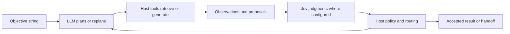
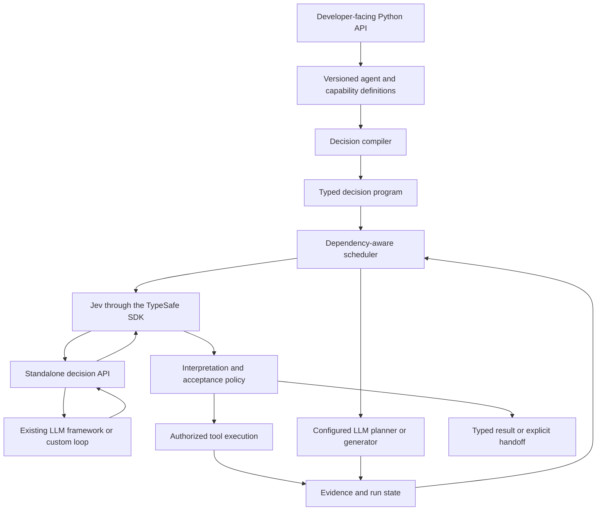

# Jev-Frame

A proposed Python framework for building Jev agents and integrating Jev decisions into existing LLM agents.

**Status: design and repository initialization only.**
There is no installable framework, implementation, executable example, or published package yet.
This is an independent project, not an official TypeSafe product.

## Purpose

Let developers create specialized agents through a public programming interface instead of constructing model requests and implementing orchestration themselves.
An agent author supplies an objective, typed tools, meaningful decisions, an output contract, and operating limits.
The framework manages evidence, compiles Jev questions, schedules evaluations and tools, and returns supported results or explicit unresolved outcomes.

The intended product is one framework with a reusable runtime underneath its developer-facing API.
Developers can also use its decision API directly inside another framework without adopting the Jev-Frame scheduler or defining a complete Jev agent.
An LLM can own planning, generation, and replanning while Jev supplies structured judgments at developer-selected points in the loop.
Application-specific integrations belong in separate capability packages, not in the core.

## Why design around Jev

Jev evaluates supplied state and returns typed decisions rather than arbitrary generated text.
Its primitives are Choice, Noul, and Score, with probabilities and, where applicable, confidence.
Questions within one request are evaluated independently.
These properties suggest a framework built around decision dependencies and evidence rather than a conversational transcript.

The framework should exploit those properties through candidate binding, parallel independent judgments, explicit state, and selective recomputation.
It must not assume that a constrained output is correct, that confidence grants permission, or that a model can select a candidate it never received.

Official references: [System One](https://docs.typesafe.ai/concepts/system-one.md), [primitives](https://docs.typesafe.ai/primitives.md), and [state](https://docs.typesafe.ai/concepts/state.md).

## Framework, agents, and runs

| Concept | Meaning |
|---|---|
| Framework | Public API, decision compiler, evidence state, scheduler, execution policy, and evaluation support |
| Agent definition | A versioned objective family, tool set, judgment vocabulary, result contract, and policy |
| Agent run | One scoped task with its own inputs, state, budget, and result |
| Capability package | Reusable tools and semantic contracts for a domain or application |

Many definitions and concurrent runs can share the same runtime.
Creating an agent definition does not require creating a resident model or copying an event loop.
Execution remains bounded by provider capacity, tool limits, budgets, and permissions.

## Intended developer experience

Python is the proposed first language.
Public names and signatures are not finalized, and this README does not present fictional installation or usage commands.

A developer should be able to:

1. Register ordinary typed functions as tools, including their purpose and argument sources.
2. Define reusable semantic judgments with explicit subjects and possible outcomes.
3. Define an agent's objective, available capabilities, result shape, and completion conditions.
4. Run a task with application-supplied scope and operating limits.
5. Inspect its result, supporting evidence, unresolved questions, trace, and usage.
6. Evaluate behavior on held-out examples before enabling consequential actions.
7. Call a standalone Jev judgment from an existing LLM tool, graph node, evaluator, or execution hook.
8. Start with an objective string and let a configured LLM agent plan and replan using the application's tools and Jev decisions.

Simple agents should require little configuration.
Advanced applications should be able to control candidate providers, decision dependencies, persistence, and acceptance policy through the same runtime.

## Working with existing LLM frameworks

Framework integration is a first-class part of the proposed product.
Developers choose how much of Jev-Frame to adopt and where Jev participates.

| Mode | Who owns the outer loop | What Jev-Frame supplies |
|---|---|---|
| Embedded decisions | An existing LLM framework or custom application. | An asynchronous decision API usable as a tool, node, router, evaluator, or required checkpoint. |
| Jev agent | The shared Jev-Frame runtime. | The compiler, evidence state, investigation, tool execution, and completion contracts described below. |
| Hybrid agent | A selected host framework, or the Jev-Frame runtime calling a configured planner. | Interoperation between LLM planning and generation, Jev judgments, tools, and evidence. |

Start with a judgment, its subjects, supplied evidence or candidates, and a context for a direct decision call.
A complete `AgentDefinition` and a new event loop are unnecessary for that use case.
Return a typed decision with its distribution, provenance, usage, and any acceptance result, rather than converting Jev into a free-form chat model.
Direct judgments without an acceptance policy remain usable observations; they do not claim supported task completion or authorize execution.

In an LLM-owned loop, the developer can expose Jev as an optional tool or place it at a required graph or execution boundary.
An optional tool lets the LLM decide when a judgment is useful.
A required checkpoint is invoked by the host's control flow so the LLM cannot skip it merely by choosing another tool.
Its enforcement covers only execution paths routed through that checkpoint.

This supports open-ended planning from an objective without requiring a prewritten task graph.
The developer still configures the available capabilities, operating limits, and completion policy.
An LLM may propose new decompositions, queries, and drafts; registered capabilities determine what the application can execute.
Jev may select a candidate, assess evidence, score a draft, route to a specialist, or identify a need for more investigation.
The developer decides which judgments are useful rather than paying for Jev on every step automatically.

### Integration targets and reuse

The first reference integrations should cover LangChain/LangGraph and Pydantic AI, with ordinary asynchronous Python callables as the portable baseline.
[LangChain tools](https://docs.langchain.com/oss/python/langchain/tools) provide callable integration points, and [LangGraph](https://docs.langchain.com/oss/python/langgraph/workflows-agents) supports agent loops and explicit workflow nodes.
[Pydantic AI function tools](https://pydantic.dev/docs/ai/tools-toolsets/tools/) provide another callable boundary.
Pydantic AI already documents a [native TypeSafe/Jev integration](https://pydantic.dev/docs/ai/models/typesafe/), including model routing and LLM fallback patterns.
Reuse that integration when it preserves the required semantics and metadata; do not implement a competing Pydantic model adapter merely to rename it.

Jev-Frame's additional value is reusable candidate binding, evidence provenance, dependency handling, policy integration, and inspection across these usage modes.
Optional adapters should translate schemas, context, results, and events through public interfaces while preserving the host's memory, streaming, persistence, and human-intervention mechanisms.
The core must import and operate without either reference framework installed.
Other frameworks can integrate through the callable contract; native support is claimed only after version-specific conformance checks.

Only one component owns each loop, retry policy, and tool dispatch.
The host remains responsible for operations it runs outside Jev-Frame, including their budgets and permissions.
A combined usage total requires visibility into both providers and all underlying attempts; unavailable external usage stays explicitly unknown.
Host checkpointing does not automatically make Jev-Frame state resumable or external effects safe to replay.

## Developer experience and capability baseline

The following ten features are accepted design requirements for the initial implementation backlog, not implemented behavior.
They compose over the same decision API, evidence model, and runtime rather than introducing independent agent engines.

| Feature | Required developer-facing behavior | Boundary |
|---|---|---|
| Decision operations | Select candidates, filter items, assess propositions, score with a rubric, and bind exact source fields or spans. | Expose evidence and request counts; ranking needs an explicit comparison strategy. |
| Reusable decision packages | Bundle versioned tools, judgments, bindings, examples, and regression cases with replaceable application functions. | Use ordinary explicit Python registration; acceptance thresholds are application choices. |
| Preview and debugging | Inspect compiled questions, evidence projections, candidates, dependencies, and argument sources before dispatch, then inspect recorded decisions. | Offline preview makes no provider/tool calls and does not invent model reasoning. |
| Capture and regression replay | Export an explicitly selected, sanitized run as a fixture and replay recorded responses offline. | Reevaluate only through a separate explicit operation; offline replay never repeats external effects. |
| Examples-to-policy workflow | Compare versioned acceptance rules on labeled cases, evaluate on held-out data, and run advisory shadow comparisons. | No automatic policy promotion; shadow mode cannot dispatch business mutations. |
| Tool reuse and discovery | Wrap existing framework or host-supplied MCP tools and retrieve a bounded relevant subset of an explicitly registered catalog. | Schemas do not establish authority, argument provenance, or effect safety. |
| Propose and select | Let a configured LLM propose alternatives, reject structurally invalid options, and use Jev to evaluate the remaining candidates. | Generated factual claims remain proposals until supported by sources. |
| Large document collections | Retrieve passages, assess individual claims, and combine findings with source references and coverage metadata. | Do not compare independent batch probabilities as a global ranking or hide retrieval gaps. |
| Useful investigation | Choose among evidence retrieval, corroboration, refresh, specialist calls, or a precise clarification request. | Bound attempts and stop unchanged cycles; host-managed continuation handles clarification responses. |
| Generate and verify | Generate an artifact, apply deterministic and configured semantic checks, and revise against actionable findings. | Deterministic failures cannot be overridden by model confidence; arbitrary generated code is not executed by the core. |

Begin with callable decision operations, diagnostics, and framework adapters, then reuse these for the complete agent runtime and hybrid recipes.
Recorded replay is a test facility, distinct from restarting a live workflow or resuming a pending external write.
Document processing remains a generic capability package with injected retrieval; the core does not acquire a vector database or crawler.
Tool discovery works within host-supplied registrations and does not scan installed packages or connect to arbitrary remote servers.
These features expand what an application can compose around Jev without changing the model's native input or output capabilities.

## Proposed public concepts

These concepts describe the intended API; they are not implemented classes.

| Concept | Developer responsibility | Framework responsibility |
|---|---|---|
| Agent | Objective, tools, result, and operating policy | Compile and run the task |
| Tool | Typed operation, semantic purpose, argument sources, and side effects | Bind valid arguments, execute, and record outcomes |
| Judgment | Question meaning, subjects, alternatives or rubric | Construct Jev evaluations and retain distributions |
| Evidence | Values with source, scope, and freshness metadata | Track dependencies and build decision-specific views |
| Run result | Define what completion means | Return outcome, evidence, unresolved items, and usage |
| Decision call | Supply a judgment, subjects, evidence, and context. | Evaluate without starting a complete agent run. |
| Framework adapter | Choose the host framework and state projection. | Translate public calls, results, and lifecycle events. |
| Planner capability | Supply an LLM agent or callable and its allowed capabilities. | Validate proposals and integrate feedback when Jev-Frame owns the loop. |

Type hints alone are insufficient to create a reliable agent.
A string may represent a record ID, a verbatim source value, or newly generated prose, and each needs a different binding strategy.
Semantic contracts must describe where values come from and what the decision establishes.

## Architecture

These are logical boundaries, not a requirement for separate services.
Prefer an embeddable library and existing application infrastructure over a new platform.
The official [Python SDK](https://docs.typesafe.ai/sdk/python.md) should supply provider transport where suitable.
The standalone decision path reuses question compilation, evidence projection, and response validation without entering the agent scheduler.

### Decision compiler

Compile task subjects, tool contracts, live candidates, and decision definitions into typed evaluation nodes with explicit dependencies.
Each generated question must identify its subjects and meaning without relying on its question ID.
Keep correlated arguments together: independently valid fields can still form an invalid combination.
Use valid tuples or sequential binding when one argument determines another's candidates.

Compiler checks can validate structure and references.
They cannot prove that a natural-language policy is correct or unambiguous.

### Candidate providers

Retrieve possible records, source values, capabilities, or approved plan templates before asking Jev to select among them.
Preserve retrieval scope, truncation, source version, and a way to expand the search.
Offer an explicit outcome when no candidate fits.
Do not hide the expected decision inside candidate metadata.

### Evidence state

Retain source observations, exact derived values, model judgments, and approved decisions as distinct records.
Build compact views for each decision while preserving relevant contradictions and links to originals.
Invalidate dependent judgments when their evidence, policy, model, or candidate set changes.
Reuse data only within compatible scope and authorization boundaries.

### Scheduler

Batch independent judgments when their inputs are ready.
Use explicit speculative premises for branch-specific questions, then consume only the applicable answers.
Create another evaluation boundary when a question genuinely depends on an earlier answer.
Execute independent reads concurrently when scope and consistency permit; never speculate on external mutations.

### Adaptive investigation

Represent unresolved questions explicitly and expose tools that can address them.
Distinguish missing evidence, source conflicts, insufficient candidate coverage, refuted claims, and semantic ambiguity.
Permit bounded retries, alternative sources, and expanded retrieval.
Continue while an action can make useful progress, rather than repeating requests until confidence rises.

### Acceptance and execution

Keep semantic confidence, evidence sufficiency, action selection, and execution authority separate.
Calibrate acceptance behavior on validation data and freeze it for held-out testing.
Apply permissions, schema checks, source-version checks, and transaction controls independently of model output.
Reconcile ambiguous write outcomes before retrying; do not promise exactly-once effects without downstream support.

### Agent composition

Expose an agent as a typed capability when another agent needs its specialization.
Exchange results and evidence references rather than free-form conversations by default.
Child runs inherit narrower-or-equal authority and a shared overall budget.
Bound concurrency, propagate cancellation, detect cycles, and preserve conflicting results.

### LLM planning and generation

An LLM may be the primary planner throughout a run, a specialist called by Jev, or an optional fallback.
Reuse the developer's existing framework agent or typed callable for this role.
When Jev-Frame owns the loop, a planner receives the objective, permitted observations, capability descriptions, and prior outcomes, then proposes a bounded next step or plan revision.
The compiler validates proposals against registered capabilities, and the runtime supplies results and unresolved issues for replanning.
When another framework owns the loop, it manages planning and execution and invokes Jev through the standalone decision API or an adapted Jev agent.
Generated arguments use explicit generated-value bindings, while identifiers and source quotes retain their candidate or source bindings.
Generated content remains a proposal until the relevant application checks accept it.
Do not automatically promote a generated plan into permanent policy.

## Scope boundaries

The core should contain reusable agent machinery, not application-specific business rules, customer data, credentials, or private benchmark history.
Domain packages should supply their own tools, vocabularies, policies, and completion contracts.
The host application should supply authorization, tenant scope, storage, and permission for side effects.

The initial design does not require a new database, distributed queue, model gateway, multi-language runtime, visual builder, or hosted service.
Add such components only when concrete use cases justify them.

## Evaluation principles

Measure supported independent completion separately from correct escalation.
Record harmful automatic errors, unnecessary handoffs, retrieval failures, service failures, latency, and verified cost per correct completion.
Keep expected answers and evaluator-only metadata outside model inputs.
Evaluate acceptable evidence paths rather than enforcing a predetermined tool sequence.

Compare sufficient-evidence Jev, agentic retrieval, and relevant existing alternatives under matched conditions.
For hybrid use, compare the same host agent with and without selected Jev judgments and include the usage and latency of both providers.
Test unfamiliar combinations of registered tools without changing the core controller for each example.
Report the amount of new semantic configuration each domain requires.
Do not treat repeated cases as independent samples or claim that small error-free tests establish full reliability.

## Current repository contents

| Path | Purpose |
|---|---|
| `README.md` | Project intent, proposed architecture, and scope |
| `AGENTS.md` | Project instructions for coding agents |
| `IMPLEMENTATION_PLAN.md` | Detailed proposed implementation handoff for Sol, with contracts, phases, and acceptance checks |
| `ISSUES.md` | GitHub implementation roadmap, dependencies, feature coverage, and delivery rules |
| `.codex/config.toml` | Project-local Codex model defaults |
| `.codex/README.md` | Codex usage and continuation context |
| `.gitignore` | Keep credentials and generated local files out of Git |

The [implementation plan for Sol](IMPLEMENTATION_PLAN.md) defines the proposed public contracts, implementation sequence, behavioral checks, and delivery gates for this design.
Its names and interfaces remain proposals, and the plan does not authorize implementation by itself.
The first implementation phase finalizes the public API specification with representative usage scenarios before creating the runtime.
The [issue roadmap](ISSUES.md) divides this plan into independently reviewable tasks and maps all ten baseline features to delivery issues.
Implementation has not started.
Package naming, licensing, final API signatures, persistence details, and acceptance thresholds remain open decisions.

## Further reading

- [TypeSafe documentation index](https://docs.typesafe.ai/llms.txt)
- [HTTP API](https://docs.typesafe.ai/api.md)
- [Structured questions](https://docs.typesafe.ai/primitives/advanced.md)
- [Function calling](https://docs.typesafe.ai/cookbooks/function_calling.md)
- [Speculative fan-out](https://docs.typesafe.ai/patterns/fan-out.md)
- [Confidence](https://docs.typesafe.ai/confidence.md)
- [Source-value selection](https://docs.typesafe.ai/cookbooks/pre_parsed_value_extraction_cookbook.md)
- [Pydantic AI TypeSafe integration](https://pydantic.dev/docs/ai/models/typesafe/)
- [LangGraph workflows and agents](https://docs.langchain.com/oss/python/langgraph/workflows-agents)

No license has been selected yet.
Do not assume redistribution rights or publish a package until licensing is decided.
